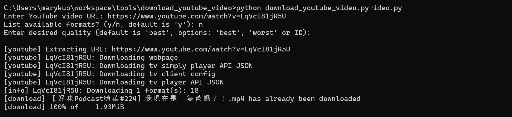
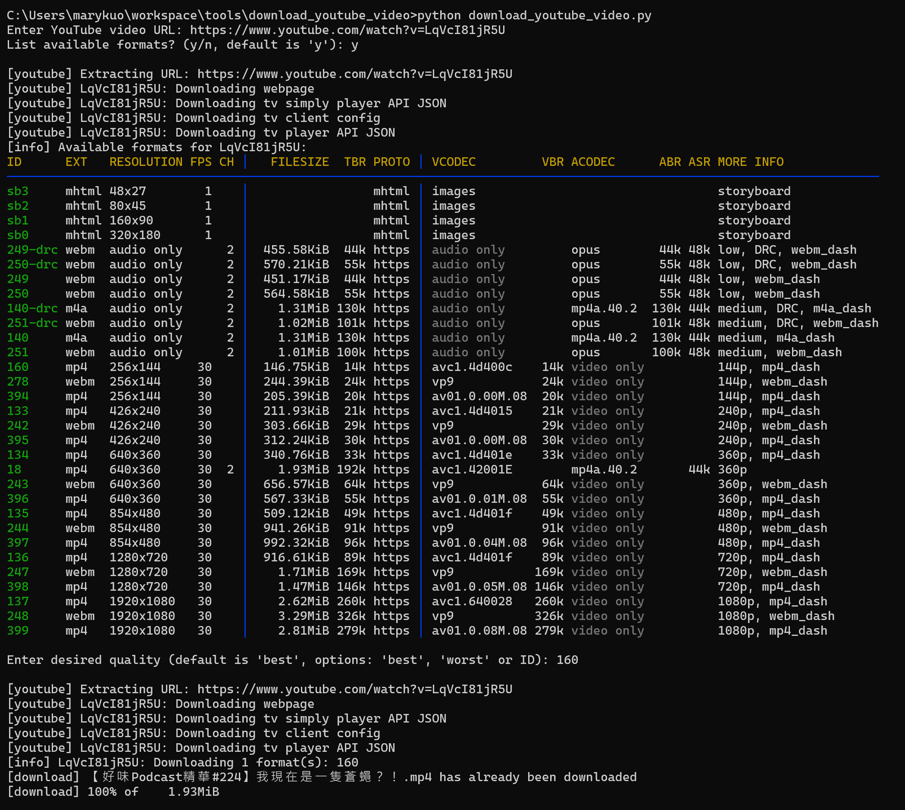

# YouTube 影片下載腳本

此 Python 腳本利用 `yt-dlp` 工具，簡單地從 YouTube 下載整部影片，可指定下載畫質及輸出檔名格式。

## Features

- 下載 YouTube 影片並指定影片格式
- 剪輯影片片段 (TBD)

## Requirements

- Python 3.x
- 已安裝 [yt-dlp](https://github.com/yt-dlp/yt-dlp) 並設定於系統環境變數中（可在終端機執行 `yt-dlp --version` 測試）

```bash
pip install -U yt-dlp
```

## Usage

1. 執行腳本：
   ```bash
   python download_youtube_video.py
   ```
2. 依序輸入：
   -  YouTube 影片網址（https://www.youtube.com/watch?v=xxxxxxx）
   -  畫質（可留空，預設為 `best`）
3. 影片會儲存在執行腳本的目錄，預設名稱為影片標題。

## Parameters

| 參數        | 說明                          | 預設值                  |
| --------- | --------------------------- | -------------------- |
| `url`     | YouTube 影片完整網址              | 必填                   |
| `quality` | 下載畫質格式（如 `best`、`worst`）    | `best`               |

## Example

下載最高畫質：



下載指定畫質：



## 注意事項

- `yt-dlp` 會根據畫質參數挑選可用格式，某些影片可能沒有指定解析度。
- 確保系統已安裝並能正常使用 `yt-dlp` 命令。
- 影片下載後，檔案名根據 `output` 參數格式自動命名。
